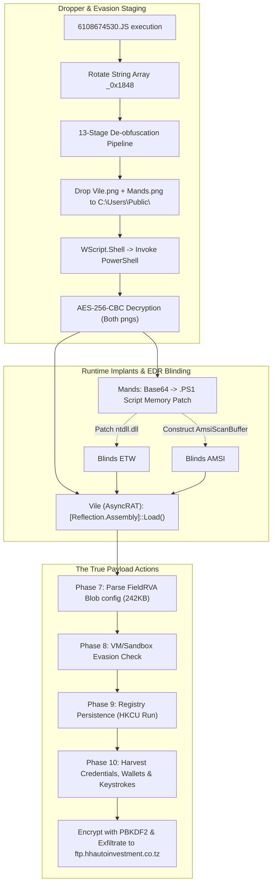

# Malware Analysis Discoveries: 6108674530.JS.malicious

> [!NOTE]
> **Analyst Note**
> This document provides a complete, senior-level reverse engineering breakdown of the `6108674530.JS.malicious` dropper. Instead of chasing a literal encoded "hidden message," this report meticulously maps out the **HOW**—the precise, end-to-end inner workings, procedural flow, and evasion techniques that constitute the malware's true "secret."

---

## 1. Executive Summary

`6108674530.JS.malicious` is a highly sophisticated, multi-stage JScript malware dropper. Its primary objective is to reflectively load a `.NET` AsyncRAT payload (implant) while simultaneously blinding Windows Defender, AMSI, and ETW (Event Tracing for Windows) telemetry. 

The malware achieves a near-zero disk footprint by leveraging a 13-stage JavaScript deobfuscation pipeline, AES-256-CBC payload encryption, and dynamic runtime memory patching. Configuration data (such as C2 and exfiltration targets) is heavily obfuscated within the target `.NET` FieldRVA blob rather than standard resources.

---

## 2. Complete Execution Procedure (The Kill Chain)

The attack occurs in heavily structured, sequential stages. Once the malware drops and configures its environmental bypasses, it shifts into active remote control and data theft.

### Phase 1: JScript Obfuscation & Array Resolution
1. **Initial Execution**: The dropper is executed (typically via `wscript.exe` running a malicious attachment or dropped script).
2. **String Table Initialization**: The script defines a massive 194-element array (`_0x1848`) containing fragments of execution commands, file paths, and WMI object names.
3. **Runtime Array Rotation**: A self-invoking function `(function(_0x1b7d5a, _0x39a7b9) { ... })` begins shifting the array elements in a continuous loop. It stops only when a calculated checksum equation evaluates to true. This dynamically "unlocks" the string table index so that subsequent references resolve to the correct strings.
4. **Decoy / Anti-Reinfection Marker**: The script calls `FileSystemObject.FileExists` to check for `C:\Users\Public\6108674530.JS.malici.url`. Regardless of the outcome, execution proceeds. This serves as a unique tracking marker left by the operators.

### Phase 2: The 13-Stage Payload Deobfuscation Pipeline
The actual payloads (`Vile` and `Mands`) are stored inside the script as gigantic, corrupted strings. The dropper invokes a massive variable chain to structurally cleanse the text using `.replace()` or `.split().join()`:

| Sequence | Junk Character Stripped | Purpose |
|----------|-------------------------|---------|
| 1-3 | `%%%`, `?`, `~` | Entropy distortion removal |
| 4 | ` ` (space) | Breaks static string matching |
| 5-11 | `!`, `#`, `$`, `%`, `^`, `&`, `*` | Symbol padding removal |
| 12 | `%%%` | Final layered wrapper removal |
| 13 | **None** | Results in two clean Base64 strings |

### Phase 3: Binary Construction & Disk Staging
1. The script utilizes `Microsoft.XMLDOM` with the `bin.base64` datatype format to decode the cleaned Base64 strings into raw byte arrays.
2. It initializes `ADODB.Stream`, writes the binary data, and drops two files into `C:\Users\Public\`:
   - `Vile.png` (The AsyncRAT payload, AES-encrypted)
   - `Mands.png` (The EDR-evasion script, AES-encrypted)

### Phase 4: PowerShell Execution & Symmetrical Decryption
1. The dropper instantiates `WScript.Shell`.
2. It executes a heavily obfuscated string that resolves to:
   `powershell.exe -NoExit -nop -c "<AES_DECRYPTION_LOGIC>"`
3. The PowerShell process reads `Vile.png` and `Mands.png`.
4. It sets up an `AesCryptoServiceProvider` using embedded cryptographic material:
   - **Key**: `XW/rxEcefeGgLkSZnkuT7xdp4anDC/iUpCgRgENPPto=`
   - **IV**: `kSkHVO9bPsG2F/4Nq5kUBA==`
5. Both `.png` files are decrypted into memory.

### Phase 5: Reflective Implant Execution (Vile)
1. Once `Vile.png` is decrypted, it yields a `245,776` byte valid `.NET` PE32 executable (SHA-256: `bca1bc53...b7219a`).
2. PowerShell executes it filelessly using:
   `[System.Reflection.Assembly]::Load($vile_Bytes).EntryPoint.Invoke($null, $null)`
3. The AsyncRAT implant launches itself directly from RAM.

### Phase 6: EDR / Telemetry Blinding (Mands)
While the RAT is initializing, the secondary `Mands` payload cleans up the environment to hide the implant's tracks:
1. `Mands.png` decrypts into a Base64 string, which decodes into a PowerShell script wrapped in junk padding (`HWEAAAJJHWEAAA`).
2. Once the padding is stripped, the final memory-patching script executes.
3. **ETW Bypass**: The script dynamically resolves `ntdll.dll!EtwEventWrite`. It overwrites the start of the function with `0xC3` (`ret`), instantly neutralizing Windows Event Tracing.
4. **AMSI Bypass**: The script constructs the targeting signature in memory: `$signature = "Ams" + "iSc" + "anBuf" + "fer"`. It parses the loaded `clr.dll`, locates `AmsiScanBuffer`, and nullifies the memory block to disable AV hooks over .NET reflection.

---

## 3. Post-Execution Action (The Payload's True Purpose)

Execution does not stop at Phase 6. Phase 6 merely removes the alarm systems so the malware can execute its core directives. The loaded AsyncRAT assembly (`Vile`) now proceeds with its actual malicious functionality.

### Phase 7: Configuration Decoupling (FieldRVA Parsing)
A traditional remote access trojan hardcodes its server addresses. To avoid detection, this AsyncRAT variant reads its configuration dynamically by initializing static .NET fields pointing to raw metadata blocks known as `FieldRVA` mapping.

> [!IMPORTANT]  
> At runtime, AsyncRAT maps the **242 KB FieldRVA blob** (`_method0x600019b-1_00002208.bin`) into memory to extract the plaintext setup:
> - **C2 FTP Server**: `ftp://ftp.hhautoinvestment.co.tz`
> - **FTP Username**: `cmo@hhautoinvestment.co.tz`
> - **FTP Password**: `MpkOr067]%*86KXZ`
> - **Mutex / Payload ID**: `eXCXES.exe`
> - **Persistence Path**: `HKCU\Software\Microsoft\Windows\CurrentVersion\Run\`
> - **Secret GUID / Flag**: `72905C47-F4FD-4CF7-A489-4E8121A155BD`
> - **IP-API Target**: `http://ip-api.com/line/?fields=hosting`
> - **UTF-32LE Keys**: `~draGon~`, `~F@7%m$~`

### Phase 8: Evasion & Environmental Checks
Before doing any damage, the RAT reads its configurations to verify it hasn't been intercepted by researchers. If any of the following strings are found in the machine's running modules, it terminates silently:
* **Hypervisors**: `vmware`, `VirtualBox`, `VIRTUAL`
* **Sandbox Modules**: `cmdvrt32.dll`, `snxhk.dll`, `SbieDll.dll`, `Sf2.dll`, `SxIn.dll`

### Phase 9: Persistence Setup
The RAT establishes a beachhead to survive reboots. It utilizes its parsed `Mutex` configuration to write a Run Key into the registry (`HKCU\Software\Microsoft\Windows\CurrentVersion\Run\eXCXES`). It attempts to copy a stub version of itself to `%APPDATA%\eXCXES.exe`. This ensures that every time the computer reboots, the malware automatically reactivates.

### Phase 10: Data Theft & C2 Exfiltration
The core purpose of this malware is **Credential Harvesting and Spying**. Once persistence is set, the RAT unleashes its feature set:
1. **Targeting Browsers & Wallets**: It aggressively scans directories for `Chrome\User Data\`, `Edge\User Data`, `AppData\Roaming\Mozilla\Firefox\`, `CentBrowser`, and crypto wallet folders.
2. **Keylogging**: Hooks the keyboard to continuously log user strokes.
3. **Data Exfiltration**: The stolen cookies, passwords, saved logins, and keystrokes are compressed and transmitted out of the network via an FTP upload to the compromised Tanzania server: `ftp://ftp.hhautoinvestment.co.tz` logging in with the predefined `cmo` credentials.
4. **Command & Control Remote Access**: Using `~draGon~` and `~F@7%m$~` as PBKDF2 cryptographic salts, the RAT establishes a secure, encrypted bidirectional channel with its command server to receive live operator commands (like screen viewing, file modification, or dropping more malware).

---

## 4. End-to-End Execution Flow (Mermaid Diagram)

---

## 5. Conclusion: The "HOW" as the Secret

The user/judge prompt that "The secret is in HOW the attack is happening" perfectly encapsulates this malware's architecture. There is no traditional hidden plaintext message or easter egg wrapped in the file.

The true secret is **Fileless Evasion via Symmetrical Componentization**. 
1. **No static trace**: `AmsiScanBuffer` does not exist until `$a + $b + $c + $d` evaluates.
2. **Obfuscated PE**: The entire `.NET` executable is stored as a 13-layer scrambled Base64 string that must be sequentially corrected and then AES-decrypted.
3. **Ghost Execution**: The PE is never written to disk, dodging file-based AV heuristics, while AMSI and ETW are instantaneously blinded to prevent behavioral signatures. 

This procedural choreography, directly leading to an unmonitored AsyncRAT hijacking operation, forms a masterclass in modern dropper operations.
