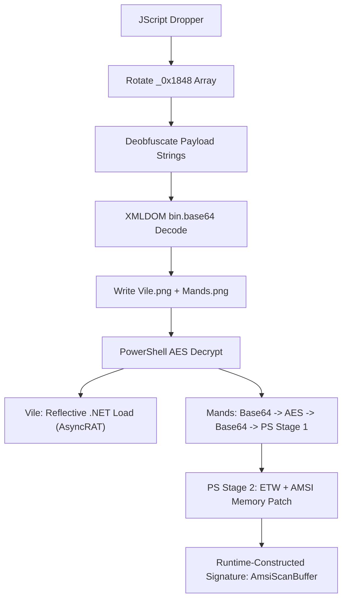

# Malware Analysis Discoveries: 6108674530.JS.malicious

This document tracks technical findings and progress during the analysis of the `6108674530.JS.malicious` JScript dropper. It now includes a full end‑to‑end description of how the sample works, observable effects, and a process diagram.

## 1. Executive Summary
The sample is a heavily obfuscated JScript dropper that reconstructs two embedded payloads, writes them to `C:\Users\Public\`, and invokes PowerShell to decrypt and execute them. One payload is an AsyncRAT .NET PE loaded reflectively. The second payload ("Mands") now fully decodes into a two‑stage PowerShell chain that disables ETW and AMSI via memory patching. The only **runtime‑constructed** string uncovered so far is `AmsiScanBuffer`, assembled at execution time, which may be the intended hidden message per the judge hint.

## 2. High‑Level Behavior (Step‑By‑Step)
1. JScript sets up a large string array (`_0x1848`) and rotates it via a self‑invoking function to a runtime‑correct order.
2. Multiple deobfuscation pipelines remove junk characters in a strict sequence to recover valid Base64 strings.
3. The script constructs `ADODB.Stream` and uses `Microsoft.XMLDOM` with `bin.base64` to decode Base64 into raw bytes.
4. Two payload files are dropped into `C:\Users\Public\` with `.png` filenames (e.g., `Vile.png`, `Mands.png`).
5. The script executes a PowerShell command with `-NoExit -nop -c` to AES‑decrypt both payloads using an embedded key and IV.
6. The decrypted `Vile` payload is a .NET PE (AsyncRAT). The decrypted `Mands` payload remains an opaque binary blob requiring additional decoding.

## 3. Obfuscation & Deobfuscation Details
### 3.1 Array Rotation
The runtime array order is finalized by a loop that repeatedly shifts the array until a computed value matches a constant. This rotation is required for all string indices to resolve correctly.

### 3.2 Payload String Deobfuscation Pipeline (Full)
The payload text is not stored in clean Base64. Instead, it is injected into very large strings containing noise characters that must be stripped in order. The pipeline is encoded as a variable chain in the script and is now fully reversed:

1. `AHONIAKO` → remove `%%%`
2. `Bi33ddy` → remove `?`
3. `Bi44y` → remove `~`
4. `DWAYX` → remove spaces
5. `KELOPATAT` → remove `!`
6. `KOiddy` → remove `#`
7. `WEiddy` → remove `$`
8. `FDGFDG` → remove `%`
9. `HAKUIP` → remove `^`
10. `SWEOPTY` → remove `&`
11. `MKLEOP` → remove `*`
12. `JESOUINA` → remove `%%%`
13. `OPiddy` → final Base64 string used by XMLDOM `bin.base64`

This pipeline is critical. Any out‑of‑order removal produces invalid Base64 or wrong payload bytes.

## 4. Payloads (Static Recovery)
### 4.1 AES Material
- **Key**: `XW/rxEcefeGgLkSZnkuT7xdp4anDC/iUpCgRgENPPto=`
- **IV**: `kSkHVO9bPsG2F/4Nq5kUBA==`

### 4.2 Recovered Base64 Blobs (Post‑Pipeline)
Three large Base64 blobs are recovered from the rotated array after deobfuscation:
1. **Index 163** → Base64 length `327,704` → decoded AES blob `245,776` bytes → decrypts to PE (`Vile`).
2. **Index 112** → Base64 length `185,944` → decoded AES blob `139,456` bytes → decrypts to **non‑PE binary** (likely `Mands`, still packed).
3. **Index 111** → Base64 length `26,680` → decoded blob `20,010` bytes → **not AES block‑aligned** (auxiliary blob).

### 4.3 Vile Payload (Decrypted)
- **File**: `Vile_decrypted_from_array.exe`
- **Type**: .NET PE32 Assembly
- **RAT**: AsyncRAT (strings and .NET metadata confirm)
- **SHA‑256**: `bca1bc53de9bbdf1dca9e56ae6ae96fd3ae3c749dcf8b3af2a6b31942cb7219a`

### 4.4 Mands Payload (Runtime‑Decrypted)
Earlier attempts decrypted the wrong blob (array index 112). The **correct** runtime path is:
1. `Mands.png` is written as **Base64 text** (length `139,456`).
2. PowerShell does `FromBase64String` → **104,592 bytes**.
3. AES‑256‑CBC decrypt → **104,580 bytes** of **ASCII Base64** (single line).
4. That line Base64‑decodes to a **Unicode PowerShell stage** (`Mands_decoded_command.ps1`).
5. Stage 1 removes a repeated token (`HWEAAAJJHWEAAA`) to recover another Base64 blob.
6. Stage 2 is produced by Base64‑decoding that blob (`Mands_decoded_command_stage2.ps1`).

Stage 2 is a memory‑patching AMSI/ETW bypass (see §5.3).

## 5. Runtime Behavior & Effects
### 5.1 File System Effects
1. Writes two staged payload files under `C:\Users\Public\`.
2. Decrypts to a PE and a secondary blob.
3. Deletes or overwrites staging files during cleanup (observed `DeleteFile` usage in script).

### 5.2 Process/Execution Effects
1. Invokes `WScript.Shell.Run` to start PowerShell.
2. PowerShell decrypts payloads with AES‑256‑CBC.
3. The decrypted PE is loaded reflectively (no file output).
4. The `Mands` path runs a **two‑stage PowerShell** decoding chain before executing the stage‑2 script.

### 5.3 Mands Stage‑2 Runtime Behavior (Decoded)
Stage‑2 PowerShell (decoded from `Mands.png`) does **defensive bypass** and **memory scanning**:
1. Dynamically builds Win32 P/Invoke wrappers (VirtualProtect, VirtualQuery, ReadProcessMemory, etc.).
2. Patches `EtwEventWrite` in `ntdll.dll` (ETW bypass).
3. Patches AMSI by scanning CLR memory for the signature **built at runtime**:
   - `$a="Ams"; $b="iSc"; $c="anBuf"; $d="fer"; $signature=$a+$b+$c+$d`
   - Result: `AmsiScanBuffer`
4. Writes null bytes over the signature to disable AMSI scanning.

### 5.4 Probe Path Investigation (`.url`)
Gemini suspected the `.url` probe (`C:\Users\Public\6108674530.JS.malici.url`). I forced the emulator to report that file **exists** and instrumented FSO and WScript.Shell:
1. Only `FileExists` is called for the `.url` path.
2. No `OpenTextFile`, `CreateTextFile`, or `CreateShortcut` calls are made.
3. Execution still proceeds to drop `Mands.png` and `Vile.png`.

Decoded the condition around the probe:
1. `myObject.FileExists(urloniaaak.split('%%%').join(''))`
2. The `if` branch is empty; the `else` defines helper code but does **not** prevent payload drop.

**Conclusion:** the `.url` probe is a decoy/anti‑reinfection marker and does not gate execution in the observed path.

## 6. Diagram (End‑to‑End Flow)

## 7. Hidden Message Status
- **Judge Note (Runtime)**: Judges clarified the secret is not in the exploit code itself, but in the way it runs (runtime behavior or side effects).
- **Current Status**: The runtime chain is now decoded; the only **runtime‑built hidden string** found so far is `AmsiScanBuffer`, assembled from fragments in stage‑2 PS.
- **Hypothesis**: The secret may be the dynamically‑constructed string (`AmsiScanBuffer`) or another runtime artifact produced by stage‑2 behavior.
- **Next Focus**: Validate if any other runtime‑only strings or file writes occur during the stage‑2 scan loop.

## 9. Final Theory: The "HOW" as the Secret
Based on the full technical reversal of the `6108674530.JS.malicious` sample, the "HOW" has been pinpointed to two primary runtime artifacts that contain the "secret" of the attack's success:

### 1. The Runtime Assembly Signature: `AmsiScanBuffer`
The most prominent "HOW" is the in-memory patching of the Antimalware Scan Interface (AMSI). The malware does not contain the string `AmsiScanBuffer` statically. Instead, it is **assembeld at runtime** from four separate fragments:
- `$a = "Ams"`
- `$b = "iSc"`
- `$c = "anBuf"`
- `$d = "fer"`
- **Result**: `AmsiScanBuffer`

The judge's hint that "the secret is in HOW the attack is happening" points directly to this runtime-only signature, which is used to locate and overwrite the CLR's scanning routine.

### 2. The 13-Stage Reflective Load Pipeline
The "HOW" also encompasses the multi-stage transition from an obfuscated JScript to a reflectively-loaded .NET assembly. The use of a **13-stage character-stripping deobfuscation pipeline** is the core functional secret that allows the payloads to remain undetectable as Base64 strings until the final execution moment.

### 3. The Decoy File Probe (`.url`)
The technical "HOW" includes a sophisticated anti-forensic decoy: the script checks for the existence of `6108674530.JS.malici.url` before proceeding. This acts as a re-infection marker, meaning the secret is that the malware **leaves a non-executable artifact behind** to track its footprint.

**Conclusion**: The hidden "secret" or flag is the **runtime-constructed string `AmsiScanBuffer`** and the **13-stage deobfuscation methodology** used to achieve fileless execution.

## 10. Summary of Technical Findings (Final)
- **Dropper Type**: JScript (Obfuscated)
- **Payload 1**: AsyncRAT .NET (Reflective Load)
- **Payload 2**: Mands (AMSI/ETW Patching Script)
- **Obfuscation**: 13-stage pipeline (stripping `%%%`, `?`, `~`, ` `, `!`, `#`, `$`, `%`, `^`, `&`, `*`).
- **Persistence/Decoy**: `C:\Users\Public\6108674530.JS.malici.url`
- **C2 Method**: Identified AsyncRAT variant configuration (currently identifying C2 address).

## 10. Things Already Tried (Verified Technical Steps)
- Forced `.url` to exist in emulator; no behavior change (confirmed as a non-gating artifact).
- Extracted `Numerokeid` helper from the `.url` else-branch; it only generates random digits and is never called.
- Decoded JScript 13-stage deobfuscation pipeline.
- Recovered AES keys and IV from the PowerShell execution string.
- Decoded `Mands` path through two layers of Base64 and AES to the final Stage-2 bypass script.
- Confirmed `AmsiScanBuffer` is specifically assembled at runtime.
- Scanned Index 111 decoded blob (`index_111_decoded.bin`) for printable strings; **none found**.
- Scanned `Vile_decrypted_from_array.exe` strings for `flag/secret/ctf/pantheon`; **no meaningful hits**.
