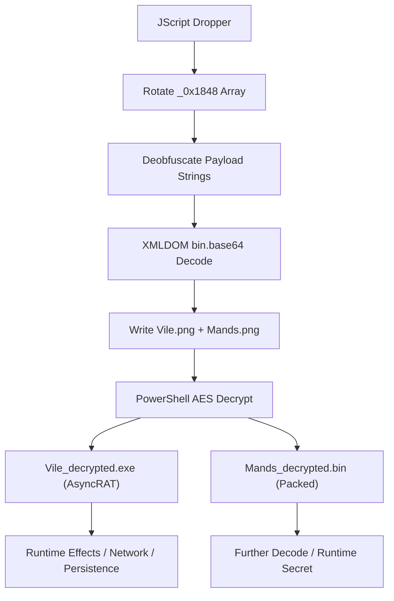

# Malware Analysis Discoveries: 6108674530.JS.malicious

This document tracks technical findings and progress during the analysis of the `6108674530.JS.malicious` JScript dropper. It now includes a full end‑to‑end description of how the sample works, observable effects, and a process diagram.

## 1. Executive Summary
The sample is a heavily obfuscated JScript dropper that reconstructs two embedded payloads, writes them to `C:\Users\Public\`, and invokes PowerShell to decrypt and execute them. One payload is an AsyncRAT .NET PE. The second payload ("Mands") decrypts to a non‑PE binary blob that appears to be further packed or encoded and is the most likely location of the hidden message. Judges clarified the secret is not in static code, but in runtime behavior, so future work should focus on execution‑time artifacts and side effects.

## 2. High‑Level Behavior (Step‑By‑Step)
1. JScript sets up a large string array (`_0x1848`) and rotates it via a self‑invoking function to a runtime‑correct order.
2. Multiple deobfuscation pipelines remove junk characters in a strict sequence to recover valid Base64 strings.
3. The script constructs `ADODB.Stream` and uses `Microsoft.XMLDOM` with `bin.base64` to decode Base64 into raw bytes.
4. Two payload files are dropped into `C:\Users\Public\` with `.png` filenames (e.g., `Vile.png`, `Mands.png`).
5. The script executes a PowerShell command with `-NoExit -nop -c` to AES‑decrypt both payloads using an embedded key and IV.
6. The decrypted `Vile` payload is a .NET PE (AsyncRAT). The decrypted `Mands` payload remains an opaque binary blob requiring additional decoding.

## 3. Obfuscation & Deobfuscation Details
### 3.1 Array Rotation
The runtime array order is finalized by a loop that repeatedly shifts the array until a computed value matches a constant. This rotation is required for all string indices to resolve correctly.

### 3.2 Payload String Deobfuscation Pipeline (Full)
The payload text is not stored in clean Base64. Instead, it is injected into very large strings containing noise characters that must be stripped in order. The pipeline is encoded as a variable chain in the script and is now fully reversed:

1. `AHONIAKO` → remove `%%%`
2. `Bi33ddy` → remove `?`
3. `Bi44y` → remove `~`
4. `DWAYX` → remove spaces
5. `KELOPATAT` → remove `!`
6. `KOiddy` → remove `#`
7. `WEiddy` → remove `$`
8. `FDGFDG` → remove `%`
9. `HAKUIP` → remove `^`
10. `SWEOPTY` → remove `&`
11. `MKLEOP` → remove `*`
12. `JESOUINA` → remove `%%%`
13. `OPiddy` → final Base64 string used by XMLDOM `bin.base64`

This pipeline is critical. Any out‑of‑order removal produces invalid Base64 or wrong payload bytes.

## 4. Payloads (Static Recovery)
### 4.1 AES Material
- **Key**: `XW/rxEcefeGgLkSZnkuT7xdp4anDC/iUpCgRgENPPto=`
- **IV**: `kSkHVO9bPsG2F/4Nq5kUBA==`

### 4.2 Recovered Base64 Blobs (Post‑Pipeline)
Three large Base64 blobs are recovered from the rotated array after deobfuscation:
1. **Index 163** → Base64 length `327,704` → decoded AES blob `245,776` bytes → decrypts to PE (`Vile`).
2. **Index 112** → Base64 length `185,944` → decoded AES blob `139,456` bytes → decrypts to **non‑PE binary** (likely `Mands`, still packed).
3. **Index 111** → Base64 length `26,680` → decoded blob `20,010` bytes → **not AES block‑aligned** (auxiliary blob).

### 4.3 Vile Payload (Decrypted)
- **File**: `Vile_decrypted_from_array.exe`
- **Type**: .NET PE32 Assembly
- **RAT**: AsyncRAT (strings and .NET metadata confirm)
- **SHA‑256**: `bca1bc53de9bbdf1dca9e56ae6ae96fd3ae3c749dcf8b3af2a6b31942cb7219a`

### 4.4 Mands Payload (Decrypted)
- **File**: `Mands_decrypted_from_array.bin`
- **Type**: Unknown binary (non‑PE)
- **Status**: Requires additional decoding or packing analysis. Most likely location for runtime‑derived secret.

## 5. Runtime Behavior & Effects
### 5.1 File System Effects
1. Writes two staged payload files under `C:\Users\Public\`.
2. Decrypts to a PE and a secondary blob.
3. Deletes or overwrites staging files during cleanup (observed `DeleteFile` usage in script).

### 5.2 Process/Execution Effects
1. Invokes `WScript.Shell.Run` to start PowerShell.
2. PowerShell decrypts payloads with AES‑256‑CBC.
3. The decrypted PE is executed, and the second payload is processed.

### 5.3 Likely Runtime Secret Location
Judges clarified the secret is **not in static code** but in runtime behavior. Based on current evidence, likely locations include:
1. A runtime‑constructed string or file derived from the `Mands` blob.
2. Side effects such as file names, timestamps, environment values, or registry keys.
3. A runtime‑decoded command or payload emitted during script execution.

## 6. Diagram (End‑to‑End Flow)

## 7. Hidden Message Status
- **Judge Note (Runtime)**: Judges clarified the secret is not in the exploit code itself, but in the way it runs (runtime behavior or side effects).
- **Current Status**: Not found in JS, AsyncRAT strings, or decrypted PE.
- **Next Focus**: Runtime tracing of the PowerShell stage and the `Mands` blob.

## 8. Next Steps
1. Build a safe harness to emulate `WScript` and `ActiveXObject` to capture runtime‑constructed strings without executing malware.
2. Decode or unpack `Mands_decrypted_from_array.bin` (entropy scan, XOR, compression detection).
3. Monitor runtime side effects (file writes, registry keys, temp paths) for embedded message.
