# Pantheon

AI-driven malware analysis and incident response. Submit a malware sample via Telegram or voice call — a swarm of specialized AI agents analyzes it across a Docker sandbox and a live Windows VPS, extracts every indicator of compromise, reconstructs the full attack chain, and returns a voice briefing with containment and remediation steps. A live web dashboard visualizes every agent handoff, tool call, and discovery in real time.

Built for HackUSF 2026.

---

## How it works

A user submits a sample (file upload, text, or voice message) through Telegram — or places a voice call directly to Zeus via the Telegram Mini App. Hermes routes the request into a Google ADK multi-agent pipeline. Each agent is named after a Greek god and owns a specific phase of the analysis. Every agent action is streamed via WebSocket to a live dashboard that shows the swarm working.

| Agent        | God        | Responsibility                                                              |
| ------------ | ---------- | --------------------------------------------------------------------------- |
| Orchestrator | Zeus       | Routes requests, compiles final response, handles voice calls               |
| Gateway      | Hermes     | Telegram bot + ElevenLabs voice I/O + Mini App voice call interface         |
| Triage       | Athena     | Classifies threat severity, opens incident ticket                           |
| Analysis     | Hades      | Docker sandbox + Windows VPS detonation, Procmon/Wireshark/FakeNet tools    |
| Intelligence | Apollo     | Extracts IOCs, enriches with Gemini threat intel, synthesizes prior runs    |
| Response     | Ares       | Generates containment, remediation, and prevention plan with YARA/Sigma     |
| Sandbox      | Hephaestus | FastAPI service, Docker container lifecycle, EventBus, WebSocket stream     |
| Sentinel     | Artemis    | Background daemon — auto-triggers pipeline on new samples                   |

All voice interaction is handled by the Muse module via ElevenLabs. Agent memory and behavioral similarity detection are handled by the KnowledgeStore layer in Hephaestus.

---

## Architecture

```mermaid
flowchart TB
    %% ━━━━━━━━━━━━━━━━━━━━━━━━━━━━━━━━━━━━━━━━━━━━━━━━━━━━━━━━━━━━━━━
    %% LAYER 0 — USER INTERFACE
    %% ━━━━━━━━━━━━━━━━━━━━━━━━━━━━━━━━━━━━━━━━━━━━━━━━━━━━━━━━━━━━━━━
    subgraph UI["🌐 User Interface Layer"]
        direction LR
        TG["📱 Telegram Client"]
        VC["🎙️ Voice Call — Mini App"]
        DASH["📊 Next.js Dashboard"]
        TG -- "file upload / text / voice" --> HERMES
        VC -- "ElevenLabs WebSocket" --> MUSE
        DASH -- "ws://sandbox:9000/ws" --> WS_STREAM
    end

    %% ━━━━━━━━━━━━━━━━━━━━━━━━━━━━━━━━━━━━━━━━━━━━━━━━━━━━━━━━━━━━━━━
    %% LAYER 1 — GATEWAY + VOICE
    %% ━━━━━━━━━━━━━━━━━━━━━━━━━━━━━━━━━━━━━━━━━━━━━━━━━━━━━━━━━━━━━━━
    subgraph GW["⚡ Hermes — Telegram Gateway + Voice I/O"]
        direction TB
        HERMES["🏛️ Hermes Bot\n— python-telegram-bot —\ntext · voice · file routing"]
        MUSE["🎵 Muse Voice Module\n— ElevenLabs Conversational AI —\nSTT → LLM → TTS"]
        SESSION["🔐 Session Manager\nuser_id → ADK session_id"]
        HERMES --> SESSION
        MUSE --> SESSION
    end

    %% ━━━━━━━━━━━━━━━━━━━━━━━━━━━━━━━━━━━━━━━━━━━━━━━━━━━━━━━━━━━━━━━
    %% LAYER 2 — ORCHESTRATION
    %% ━━━━━━━━━━━━━━━━━━━━━━━━━━━━━━━━━━━━━━━━━━━━━━━━━━━━━━━━━━━━━━━
    subgraph ORCH["⚜️ Zeus — Root Orchestrator"]
        direction TB
        ZEUS["🏛️ Zeus Agent\n— Google ADK LlmAgent —\nGemini 2.5 Flash\nroutes · compiles · delegates"]
        RUNNER["🔄 ADK Runner\nInMemorySessionService\nstate_delta propagation"]
        SWARM["🐝 SwarmManager\njob queue · status FSM\nqueued → running → done"]
        ZEUS --> RUNNER
        RUNNER --> SWARM
    end

    SESSION -- "ADK session handoff" --> ZEUS

    %% ━━━━━━━━━━━━━━━━━━━━━━━━━━━━━━━━━━━━━━━━━━━━━━━━━━━━━━━━━━━━━━━
    %% LAYER 3 — ANALYSIS PIPELINE (A2A TRANSFERS)
    %% ━━━━━━━━━━━━━━━━━━━━━━━━━━━━━━━━━━━━━━━━━━━━━━━━━━━━━━━━━━━━━━━
    subgraph PIPELINE["🔱 Agent Analysis Pipeline — A2A Protocol"]
        direction LR

        subgraph TRIAGE["Phase 1 — Triage"]
            ATHENA["🦉 Athena\nseverity classification\nincident ticket creation\nrouting decision"]
        end

        subgraph DYNAMIC["Phase 2 — Deep Analysis"]
            HADES["💀 Hades\nDocker sandbox detonation\nWindows VPS Procmon capture\nFakeNet-NG · Wireshark\nbehavioral fingerprinting"]
        end

        subgraph INTEL["Phase 3 — Intelligence"]
            APOLLO["☀️ Apollo\nIOC extraction & enrichment\nGemini threat intel correlation\nprior-run synthesis\nformatted ThreatReport"]
        end

        subgraph RESPONSE["Phase 4 — Response"]
            ARES_C["🗡️ Ares::Containment\nnetwork isolation\nprocess termination\nfirewall rules"]
            ARES_R["🛡️ Ares::Remediation\nfile cleanup\nregistry repair\ncredential rotation"]
            ARES_P["🏰 Ares::Prevention\nYARA rules\nSigma detection\nGPO hardening\nEDR tuning"]
            ARES_A["📋 Ares::Assembler\nfull incident report\nmarkdown compilation"]
        end

        ATHENA -- "A2A transfer\nINC ticket + severity" --> HADES
        HADES -- "A2A transfer\nThreatReport + IOCs" --> APOLLO
        APOLLO -- "A2A transfer\nenriched report + intel" --> ARES_C & ARES_R & ARES_P
        ARES_C & ARES_R & ARES_P -- "parallel merge" --> ARES_A
    end

    ZEUS -- "sub_agent dispatch" --> ATHENA
    ARES_A -- "final report" --> ZEUS

    %% ━━━━━━━━━━━━━━━━━━━━━━━━━━━━━━━━━━━━━━━━━━━━━━━━━━━━━━━━━━━━━━━
    %% LAYER 4 — SANDBOX & DETONATION INFRASTRUCTURE
    %% ━━━━━━━━━━━━━━━━━━━━━━━━━━━━━━━━━━━━━━━━━━━━━━━━━━━━━━━━━━━━━━━
    subgraph SANDBOX["🔥 Hephaestus — Sandbox Service"]
        direction TB
        FASTAPI["⚙️ FastAPI Server\nPOST /sandbox/analyze\nGET /sandbox/report/:id\nGET /sandbox/iocs/:id"]
        ANALYZER["🔬 Analyzer Engine\nstatic analysis pipeline\ndynamic harness execution\njob lifecycle management"]
        KNOWLEDGE["🧠 KnowledgeStore\nSQLite WAL mode\nagent memory persistence\nbehavioral fingerprints\ncross-run similarity search"]
        EVENTBUS["📡 EventBus\nasyncio pub/sub\nWebSocket broadcast\nPantheonEvent serialization"]
        WS_STREAM["🔌 /ws Endpoint\nreal-time event stream\nauto-reconnect clients"]
        EVENTS_IN["📥 POST /events\nagent → EventBus ingest\nfire-and-forget delivery"]

        FASTAPI --> ANALYZER
        ANALYZER --> KNOWLEDGE
        EVENTS_IN --> EVENTBUS
        EVENTBUS --> WS_STREAM
    end

    subgraph DOCKER_ENV["🐋 Docker Isolation — Detonation Chamber"]
        direction TB
        CONTAINER["📦 Analysis Container\n--network none\n--memory 256m\n--read-only\n--no-new-privileges\n--cap-drop ALL"]
        HARNESS["🔧 Node.js Harness\nWScript.Shell mock\nActiveXObject intercept\nXMLHTTP capture\neval/exec logging"]
        STATIC_A["📝 Static Analysis\nstring extraction\nAST deobfuscation\nentropy scanning"]
        DYNAMIC_A["💣 Dynamic Analysis\nprocess tree capture\nregistry modification log\nfile system diff\nnetwork call intercept"]

        CONTAINER --> HARNESS
        HARNESS --> STATIC_A & DYNAMIC_A
    end

    subgraph VPS["🖥️ Windows VPS — Live Detonation"]
        direction TB
        PROCMON["📊 Procmon\nprocess creation\nfile I/O\nregistry mutations\nthread injection"]
        FAKENET["🌐 FakeNet-NG\nDNS interception\nHTTP/HTTPS capture\nC2 beacon detection\nprotocol simulation"]
        WIRESHARK["🦈 Wireshark\nfull packet capture\nTLS fingerprinting\nJA3/JA3S hashing\nbeacon interval analysis"]
        SNAP["📸 VM Snapshot\npre-detonation state\nauto-restore on complete\nisolated VLAN"]

        PROCMON --> SNAP
        FAKENET --> SNAP
        WIRESHARK --> SNAP
    end

    HADES -- "submit_sample()" --> FASTAPI
    HADES -- "SSH/SFTP\nparamiko" --> PROCMON & FAKENET & WIRESHARK
    ANALYZER -- "Docker SDK\ncontainer.run()" --> CONTAINER

    %% ━━━━━━━━━━━━━━━━━━━━━━━━━━━━━━━━━━━━━━━━━━━━━━━━━━━━━━━━━━━━━━━
    %% LAYER 5 — EVENT SYSTEM (TELEMETRY BACKBONE)
    %% ━━━━━━━━━━━━━━━━━━━━━━━━━━━━━━━━━━━━━━━━━━━━━━━━━━━━━━━━━━━━━━━
    subgraph EVENTS["📡 Real-Time Event System — PantheonEvent Protocol"]
        direction LR
        EVT_TYPES["Event Types:\n• AGENT_ACTIVATED\n• AGENT_COMPLETED\n• TOOL_CALLED\n• TOOL_RESULT\n• HANDOFF\n• IOC_DISCOVERED\n• STAGE_UNLOCKED\n• PROCESS_EVENT\n• NETWORK_EVENT\n• AGENT_COMMAND"]
        EVT_EMIT["emit_event()\nfire-and-forget\nhttpx POST /events\nnon-blocking async"]
        EVT_FLOW["Agent → POST /events\n→ EventBus.publish()\n→ asyncio.Queue per client\n→ WebSocket broadcast\n→ Dashboard EventStore"]

        EVT_TYPES --- EVT_EMIT
        EVT_EMIT --- EVT_FLOW
    end

    ATHENA & HADES & APOLLO & ARES_A -. "emit_event()" .-> EVENTS_IN

    %% ━━━━━━━━━━━━━━━━━━━━━━━━━━━━━━━━━━━━━━━━━━━━━━━━━━━━━━━━━━━━━━━
    %% LAYER 6 — DASHBOARD FRONTEND
    %% ━━━━━━━━━━━━━━━━━━━━━━━━━━━━━━━━━━━━━━━━━━━━━━━━━━━━━━━━━━━━━━━
    subgraph FRONTEND["📊 Live Dashboard — React + React Flow"]
        direction TB
        WS_CLIENT["🔌 pantheon-ws.ts\nWebSocket client\nauto-reconnect\nevent deserialization"]
        STORE["🗄️ EventStore\nZustand-style state\nagent status tracking\nevent feed buffer\nIOC accumulator"]
        GRAPH["🕸️ OlympusFlow\nReact Flow canvas\n8 agent nodes\npulse on active\nedge animation on handoff"]
        CHRONICLE["📜 DivineChronicle\nevent feed — auto-scroll\ncolor-coded by severity\nexpandable tool calls"]
        CHAIN["⛓️ AttackChain\nhorizontal stage cards\nfade-in on STAGE_UNLOCKED\nreal-time progression"]
        INSPECTOR["🔍 AgentInspector\nper-agent telemetry\ntool call history\nlatency metrics"]
        TRACE["🎬 TraceViewer\nplayback timeline\nParallelAgent visualization\nLoopAgent iteration render"]

        WS_CLIENT --> STORE
        STORE --> GRAPH & CHRONICLE & CHAIN & INSPECTOR & TRACE
    end

    WS_STREAM -- "PantheonEvent JSON stream" --> WS_CLIENT

    %% ━━━━━━━━━━━━━━━━━━━━━━━━━━━━━━━━━━━━━━━━━━━━━━━━━━━━━━━━━━━━━━━
    %% LAYER 7 — INFRASTRUCTURE
    %% ━━━━━━━━━━━━━━━━━━━━━━━━━━━━━━━━━━━━━━━━━━━━━━━━━━━━━━━━━━━━━━━
    subgraph INFRA["🏗️ Deployment Infrastructure"]
        direction LR
        VULTR["☁️ Vultr VPS\nUbuntu 22.04\n155.138.218.106"]
        NGINX["🔀 nginx reverse proxy\n:80 → routing\n/ws → sandbox:9000\n/dashboard → frontend:3000\n/sandbox/* → sandbox:9000"]
        COMPOSE["🐳 Docker Compose\n3 services\nsingle bridge network\nvolume persistence"]
        SENTINEL["👁️ Artemis Daemon\nwatchdog file scanner\n/tmp/samples monitor\nauto-pipeline trigger"]

        VULTR --> NGINX
        NGINX --> COMPOSE
        COMPOSE --> SENTINEL
    end

    %% ━━━━━━━━━━━━━━━━━━━━━━━━━━━━━━━━━━━━━━━━━━━━━━━━━━━━━━━━━━━━━━━
    %% CROSS-LAYER CONNECTIONS
    %% ━━━━━━━━━━━━━━━━━━━━━━━━━━━━━━━━━━━━━━━━━━━━━━━━━━━━━━━━━━━━━━━
    SENTINEL -. "new sample detected" .-> SWARM
    SWARM -. "job dispatch" .-> ZEUS
    ZEUS -- "voice briefing" --> MUSE
    MUSE -- "TTS response" --> TG

    %% ━━━━━━━━━━━━━━━━━━━━━━━━━━━━━━━━━━━━━━━━━━━━━━━━━━━━━━━━━━━━━━━
    %% STYLING
    %% ━━━━━━━━━━━━━━━━━━━━━━━━━━━━━━━━━━━━━━━━━━━━━━━━━━━━━━━━━━━━━━━
    classDef god fill:#1a1a2e,stroke:#c9a227,stroke-width:2px,color:#e8d5a3,font-weight:bold
    classDef tool fill:#16213e,stroke:#537ec5,stroke-width:1px,color:#c5cae9
    classDef infra fill:#0f3460,stroke:#e94560,stroke-width:1px,color:#f5f5f5
    classDef event fill:#2d132c,stroke:#ee4540,stroke-width:2px,color:#f5c7c7
    classDef ui fill:#1b262c,stroke:#bbe1fa,stroke-width:1px,color:#bbe1fa
    classDef danger fill:#3d0000,stroke:#ff0000,stroke-width:3px,color:#ff6b6b

    class ZEUS,HERMES,ATHENA,HADES,APOLLO,ARES_C,ARES_R,ARES_P,ARES_A god
    class HARNESS,STATIC_A,DYNAMIC_A,PROCMON,FAKENET,WIRESHARK tool
    class VULTR,NGINX,COMPOSE,SENTINEL,FASTAPI,ANALYZER,KNOWLEDGE infra
    class EVENTBUS,WS_STREAM,EVENTS_IN,EVT_TYPES,EVT_EMIT,EVT_FLOW event
    class TG,VC,DASH,WS_CLIENT,STORE,GRAPH,CHRONICLE,CHAIN,INSPECTOR,TRACE ui
    class CONTAINER danger
```



---

## Safety

**The malware sample (`6108674530.JS.malicious`) must never be executed directly on any machine.**

Dynamic analysis runs exclusively inside a hardened Docker container:

```
--network none
--memory 256m
--cpus 0.25
--read-only
--tmpfs /tmp/work:size=64m
--security-opt no-new-privileges
--cap-drop ALL
```

A Node.js instrumentation harness mocks all dangerous APIs (WScript, ActiveXObject, Shell) and logs intercepted calls without allowing real execution. See `sandbox/dynamic/manager.py`.

---

## Stack

- Python 3.12+, [uv](https://docs.astral.sh/uv/) package manager
- [Google ADK](https://google.github.io/adk-docs/) — multi-agent orchestration
- Gemini 2.5 Flash — LLM inference, deobfuscation analysis, memory synthesis
- [python-telegram-bot](https://python-telegram-bot.org/) — Telegram interface
- [ElevenLabs](https://elevenlabs.io/) — TTS, STT, and Conversational AI (voice calls)
- FastAPI + uvicorn — Hephaestus sandbox service + WebSocket event stream
- Docker SDK for Python — container lifecycle
- SQLite (stdlib, WAL mode) — job persistence + KnowledgeStore agent memory
- Pydantic v2 — all data models, strict typing throughout
- Next.js + Tailwind CSS — live dashboard (React Flow for agent graph)
- paramiko — SSH/SFTP to Windows VPS for Procmon/Wireshark/FakeNet-NG tools

---

## Setup

```bash
# install uv if you don't have it
curl -LsSf https://astral.sh/uv/install.sh | sh

# install dependencies
uv sync

# copy and fill in environment variables
cp .env.example .env

# run
uv run python run.py
```

---

## Environment variables

See `.env.example` for all required variables. Key ones:

| Variable                  | Description                                                             |
| ------------------------- | ----------------------------------------------------------------------- |
| `GOOGLE_API_KEY`          | Gemini API key                                                          |
| `GEMINI_API`              | Alias used by agent tools (same value as GOOGLE_API_KEY)                |
| `TELEGRAM_BOT_TOKEN`      | Telegram bot token                                                      |
| `ELEVENLABS_API_KEY`      | ElevenLabs API key                                                      |
| `ELEVENLABS_AGENT_ID`     | ElevenLabs Conversational AI agent ID (for voice calls)                 |
| `SANDBOX_API_URL`         | Internal URL of the Hephaestus service (default: `http://sandbox:9000`) |
| `WINDOWS_VPS_IP`          | IP of the Windows VPS for live detonation                               |
| `WINDOWS_VPS_USER`        | Windows VPS username                                                    |
| `WINDOWS_VPS_PASSWORD`    | Windows VPS password                                                    |

---

## Architecture docs

- Original design: `docs/superpowers/specs/2026-03-28-pantheon-design.md`
- Dashboard + event system design: `docs/superpowers/specs/2026-03-28-pantheon-dashboard-design.md`
- Malware analysis report: `docs/malware-analysis-6108674530.md`
- Team update (current state): `docs/team-update-2026-03-28.md`
- API contract: `sandbox/models.py`
- Team coding prompts: `AGENTS.md`

---

## Google ADK Demo

Pantheon exposes a live ADK Dev UI and a remote A2A specialist on Google Cloud Run.

| Surface | URL |
| ------- | --- |
| ADK Dev UI (open for judges) | https://pantheon-agents-63prhgdheq-uc.a.run.app/dev-ui/ |
| Pantheon agent API | https://pantheon-agents-63prhgdheq-uc.a.run.app |
| Remote A2A impact specialist | https://impact-agent-63prhgdheq-uc.a.run.app |

**What judges will see in the ADK UI:**
- The full Pantheon agent tree (Zeus → Athena → Hades → Apollo → Ares)
- Three Ares planning branches executing in parallel (`ares_planning_parallel`)
- A verifier/reviser self-correction loop (`ares_refinement_loop`, max 2 iterations)
- An outbound A2A handshake from Apollo to the remote `impact-agent` Cloud Run service
- The impact analysis folded back into the final incident response document

**Deploy to Cloud Run:**

```bash
export GCP_PROJECT_ID=your-project-id   # or set in .env
./infra/cloud-deploy.sh
```

The script enables required APIs, builds and pushes the Docker image to Artifact Registry, deploys both services, and wires the A2A URL automatically. Public URLs are printed at the end.

See `docs/demo-judge-walkthrough.md` for the 4-minute judge demo script.

---

## Deployment

The full stack runs via Docker Compose on a Vultr VPS. See `infra/` and `infra/deploy.sh`.

```bash
docker compose -f infra/docker-compose.yml up -d
```

---

## Team

###  Pablo Molina

###  Saicharan Ramineni

###  Gabriel Suarez

###  Andres Dominguez
